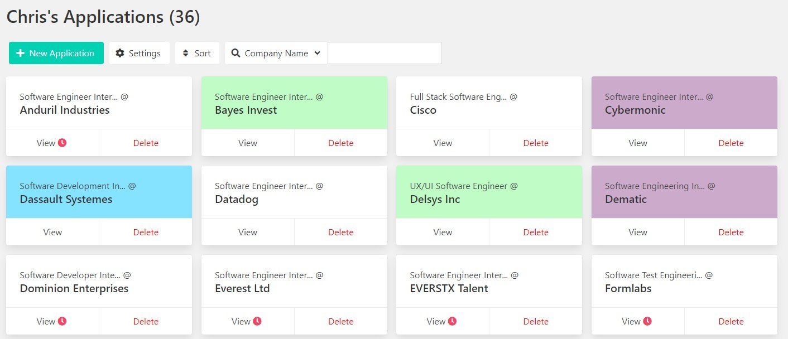
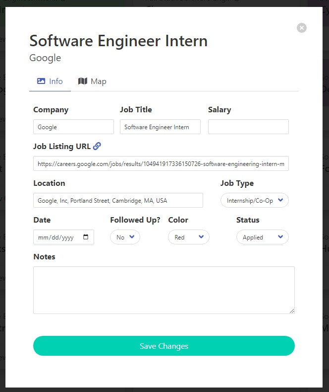

#  v1.1.6

AppliTrack is a web application that allows you to keep track of your job applications throughout your job search.

## Key Features

- Create a list of your job applications and organize them in different ways.
- View a map of your applications for easy location planning.
- Get a visual alert to follow up with your employers if it's been a while since you applied to the job.
- Look through our list of recommended job listing websites to help you on your job search.

## Changelog

The Changelog for AppliTrack can be found [here](https://pastebin.com/CT3q9k25).

## Images

